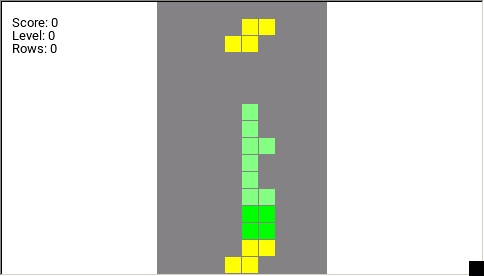

## Installation

- Download the script here: [tetris.lua](tetris.lua)
- Copy the script on your SDCARD: `/SCRIPTS/TOOLS/`.

## How to Play

- Open SYS and select "tetris"
- Use the rotating selector to move left and right
- TELE to rotate the shape
- PAGE > to drop the shape
- MDL to pause and resume the game
